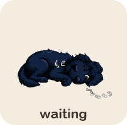
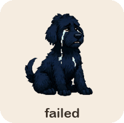

# Motive

[](https://github.com/Salable/motive/actions/workflows/ci.yml)

**Motive** is a composable Swift framework for building desktop "pet" apps on macOS — animated sprite companions that live on your desktop, react to what your tools are doing, and can be driven by AI agents over REST or MCP.

Your pet mirrors what your agent is up to — one REST or MCP call sets the state:

<p align="center">
  
  
  
  
</p>

…plus one-shot gestures (`wave`, `jump`, `dash-left`/`dash-right`) and speech bubbles to keep her feeling alive.

Rather than shipping one bundled app, Motive is a component library: pick the pieces you need and compose your own pet.

## Components

| Product | What it gives you |
| --- | --- |
| `MotiveCore` | Pure, timer-free animation state machine, the `MotiveEngine` runtime, the `MotiveControl` command surface with a self-describing schema, and the capability registry. No UI dependencies. |
| `MotiveSprite` | The sprite package model and pluggable format **runners**: `CodexRunner` (compatible with the Codex/Fido `pet.json` sprite-sheet contract) and `MotiveRunner` (the Motive-native `motive.json` format). |
| `MotiveUI` | AppKit/SwiftUI surfaces: the sprite view, the sprite box window (speech bubbles, hover skip/clear queue controls, optional chat input and action buttons), the queue window (live view of what's playing and what's next), the menu-bar notification menu, and the capability-driven settings window. |
| `MotiveHTTP` | A loopback REST control plane (token-authenticated, SSE events, self-describing schema) for driving the sprite from anything that can `curl`. |
| `MotiveMCP` | An MCP server over the same command surface, plus the `motive-mcp` stdio shim for Claude Desktop / ChatGPT Desktop. |
| `MotiveVoice` | Speech out (`AVSpeechSynthesizer`) and in (`SFSpeechRecognizer`), behind a preflight gate that refuses rather than letting macOS kill an under-entitled process. Speaking needs no permission; listening needs a bundle. |
| `MotiveAgents` | Installers that teach agent CLIs (Claude Code, Codex, OpenCode) and Claude Desktop how to talk to your pet. |

Two executables ship alongside them: `motive-demo` (the reference composition —
Winston on your desktop) and `motive-mcp` (a stdio MCP shim that discovers a
running pet and proxies to it).

## Try the demo

Requires macOS 13+. Either download `MotiveDemo-<version>.zip` from Releases
(right-click → Open the first time; the app is not notarized yet), or from a checkout
(Swift 5.10+):

```sh
swift run motive-demo
```

**Winston**, the bundled test sprite (a shaggy black labradoodle pup), appears on your
desktop — just sprite and speech bubbles, no chrome — and walks through a queued
onboarding tour of Motive's features. Hover over her during a scene for skip (⏭) and
stop (✕) controls; stopping returns her to her default idle. A paw in the menu bar has
the queue window (what's playing and what's lined up behind it), Settings, tour replay,
and Quit. Then drive the pup from a terminal:

```sh
PORT=$(python3 -c "import json;print(json.load(open('$HOME/.motive/runtime/server.json'))['port'])")
TOKEN=$(cat ~/.motive/runtime/token)
curl -H "Authorization: Bearer $TOKEN" -H "Content-Type: application/json" \
     -d '{"state": "jumping"}' "http://127.0.0.1:$PORT/v1/state"
```

or run the full tour: `./scripts/demo-curl.sh`. To drive her from Claude Desktop,
register the MCP shim (see [docs/INTEGRATIONS.md](docs/INTEGRATIONS.md)).

## Using Motive in your own app

```swift
// Package.swift
.package(url: "https://github.com/Salable/motive.git", from: "0.4.0")
// then depend on the products you need, e.g.
.product(name: "MotiveCore", package: "Motive"),
.product(name: "MotiveSprite", package: "Motive"),
.product(name: "MotiveUI", package: "Motive"),
```

Minimal pet:

```swift
let definition = try SpriteRunnerRegistry.standard.load(spriteFolderURL)
let host = SpriteHost(definition: definition)          // engine + SwiftUI bridge
let box = SpriteBoxWindow(host: host)                  // desktop window
box.show()
let control = MotiveControl(engine: host.engine, displayName: definition.metadata.displayName)
let server = MotiveServer(control: control)            // REST control plane
try await server.start()
```

The [embedding guide](docs/EMBEDDING.md) covers product selection and recipes:
MCP, menu bar + settings, custom sprite formats, agent-skill installers, and
headless use.

## Documentation

The [docs index](docs/README.md) is the map. The short version:

| | |
| --- | --- |
| **Start** | [Quickstart](docs/guides/QUICKSTART.md) · [The demo app](docs/guides/DEMO.md) · [Build your first pet](docs/guides/FIRST-PET.md) · [Troubleshooting](docs/guides/TROUBLESHOOTING.md) |
| **Understand** | [Queue](docs/concepts/QUEUE.md) · [States](docs/concepts/STATES.md) · [Questions](docs/concepts/QUESTIONS.md) · [Voice](docs/concepts/VOICE.md) · [Runtime](docs/concepts/RUNTIME.md) · [Architecture](docs/ARCHITECTURE.md) |
| **Look up** | [Components](docs/components/OVERVIEW.md) · [REST API](docs/API.md) · [Sprite formats](docs/FORMATS.md) · [Environment](docs/reference/ENVIRONMENT.md) · [CLI](docs/reference/CLI.md) |
| **Do** | [Embedding recipes](docs/EMBEDDING.md) · [Agent integrations](docs/INTEGRATIONS.md) · [Releasing](docs/RELEASING.md) |

Symbol-level API reference is generated by DocC and published to
[GitHub Pages](https://salable.github.io/motive/documentation/motivecore). The
same tree is mirrored to the [wiki](https://github.com/Salable/motive/wiki) on
every merge; the repository is the source of truth.

## Status

Early development (`0.x`). APIs will change. See [CHANGELOG.md](CHANGELOG.md).

## Contributing

See [CONTRIBUTING.md](CONTRIBUTING.md). Licensed under [MIT](LICENSE).
